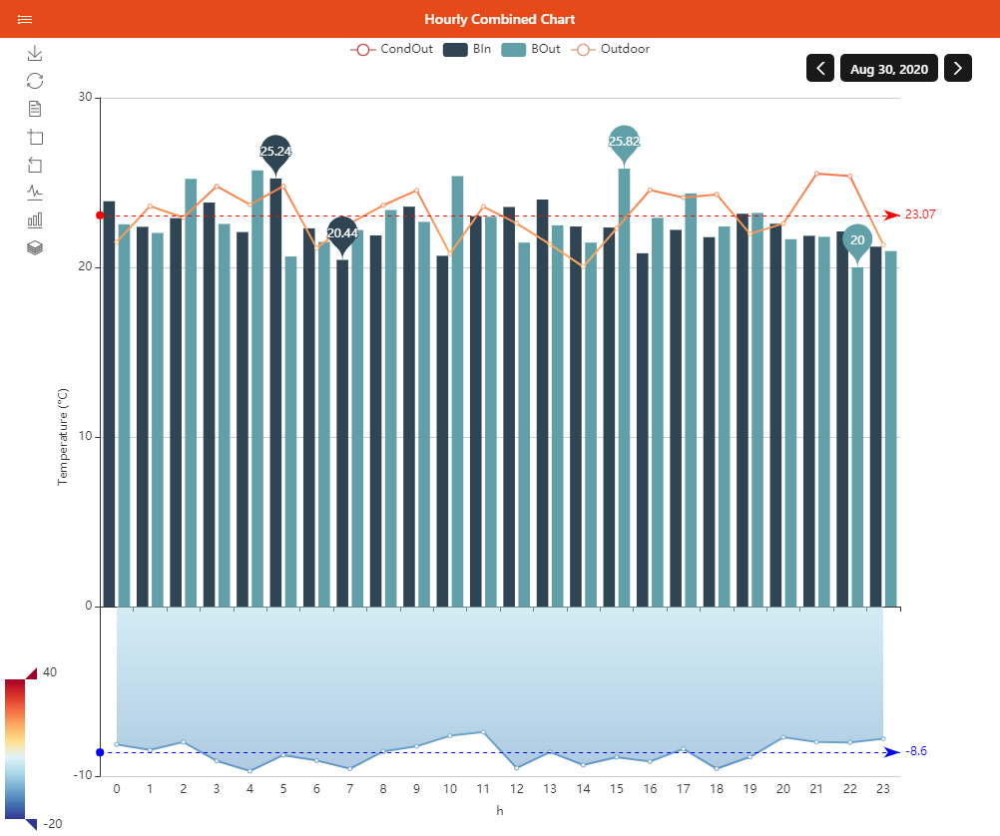

# Chart Pages

Chart Pages can display historical values in a full-screen `oh-chart` component.

## Anatomy of a Chart Page

Charts are based on the Apache ECharts library.
The [Cheat Sheet](https://echarts.apache.org/en/cheat-sheet.html) on EChart's website offers an interactive illustration of the concepts used in it.
The openHAB UI currently supports only a subset of those:

- Series: Bar, Line, Pie, Heatmap, Scatter, Gauge
- Coordinates: Grid, Calendar
- Other Components: Title, Legend, Tooltip, MarkPoint, MarkLine, MarkArea, DataZoon, VisualMap, Toolbox

The `oh-chart` and `oh-chart-page` normally configure charts using components such as `oh-grid`, `oh-time-series`, `oh-value-axis`, and others, placed in the appropriate slots.
See their documentation for more details.
Additionally, you can merge raw options as they're defined in ECharts in the root `options` parameter.

## Building a Chart Page

### From the Analyzer

Throughout the UI you may encounter places where you can click a widget to call the Analyzer window, which lets you build a chart of one or several item(s) persisted data and change some settings with simple controls.
Sometimes you'll get a result that you like and would like to save.
You can do exactly that: use the Save button on the title bar on the right, give it an identifier, and it will be saved as a Chart Page.
You can then customize it further from the Chart Page Designer.

::: tip TIP

Once you've saved the Analyzer result as a Chart Page, you can display this page like you would any other, but the controls that you used to configure the chart in the Analyzer will not be available.
Chart Pages cannot be configured by the user (except changing the period, zooming, or by using the toolbox).

You can, however, launch the Analyzer with a predetermined set of item(s), chart type and period with the "Analyze" widget action.

:::

### From the Chart Page Designer

From the Pages section in Settings, click "+" then Create Chart, or choose an existing Chart Page, to bring up the Chart Page Designer.

You can choose the period type and initial period in the Page Configuration section, and then add Coordinate Systems, Axes, Series, and other chart components.

Usually, you will first add a Grid, then either directly one or more Time Series (default axes will be created for you), or first Axes and an Aggregate Series.

When doing aggregations, you have to be careful to add the right type of axes based on the period that you chose (Aggregate Series don't support Dynamic period as chart type).

Examples:
- For bars representing hourly aggregates, use a value Y axis and a category axis configured as "Hours of day".
Then click Add Aggregate Series, choose the item, the Bar type, and "Hour of Day" as first dimension.
- For a 2-dimension heatmap representing hours for an entire month, add a category Y axis configured as "days of month" and a category X axis configured as "hours of day".
Then click Add Aggregate Series, choose the item, the Heatmap type, "Day of Month" as first dimension, "Hours of Day" as second dimension.
Since the "outer" (first) dimension is on the Y axis, make sure you also enable "Transpose" to reflect that fact.
Lastly, also make sure you add a Visual Map component to the chart since the Heatmap needs one as its color scale - even if it's hidden.

In the "Other Components" section you will have badges in the buttons representing the number of components of that type.
You can indeed add several of these components, when appropriate.
Below the title bar of the dialog to edit the component type, use the "+" tab to add one more, or use the Remove button at the bottom to remove the currently displayed component.
